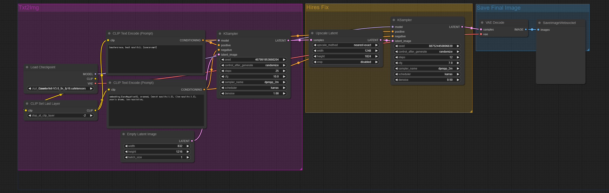

# Couterfeit V3.0 Basic

## LandScape(3:2 [1824 x 1248])


## Portait(2:3 [1248 x 1824])


## Setup
- Python 3.12.3
```bash
cd ComfyUI
pip install -r requirements.txt
pip install websocket-client

cd models/checkpoints
wget https://huggingface.co/gsdf/Counterfeit-V3.0/resolve/main/Counterfeit-V3.0_fix_fp16.safetensors
```


## Example
### LandScape
```bash
time python websockets_api.py --mode 1 --prompt "
cute angel" --save_path "./test.png"
```
```
NVIDIA L4
real    0m25.130s
user    0m2.087s
sys     0m0.028s
```
### Portait
```bash
time python websockets_api.py --mode 2 --prompt "
cute angel" --save_path "./test.png"
```
```
NVIDIA L4
real    0m25.113s
user    0m2.065s
sys     0m0.024s
```
